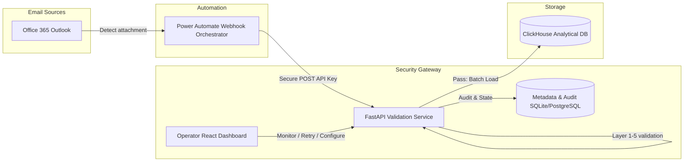

# Enterprise Ingestion Platform: Production Pitch & Adoption Proposal

This presentation outlines the business case, technical architecture, and return on investment (ROI) framework for adopting the Outlook-to-ClickHouse automated data ingestion, validation, and monitoring platform.

---

## 1. Executive Summary

Enterprise data teams frequently receive business-critical transactional spreadsheets via email attachments. Processing these sheets manually or using fragile scripting causes **schema drift errors**, **corrupt database inserts**, and **lack of audit visibility**.

This proposal presents a **validation-first ingestion gateway** that intercepts email spreadsheets via secure webhooks, performs rigorous multi-layered validation, batches insertions into ClickHouse, and reconciles records to ensure 100% data integrity.

```text
Outlook Excel  ──►  Power Automate  ──►  FastAPI Gateway  ──►  Validation Check  ──►  ClickHouse
                                                 │
                                                 └──► Fail: Zero Rows Inserted (Quarantined)
                                                 └──► Pass: Batch Inserted (Reconciled)
```

---

## 2. Problem Statement & Business Impact

| Current Pain Point | Technical Impact | Business & Financial Impact |
| :--- | :--- | :--- |
| **Manual Data Load** | Engineers spend 2–3 hours daily download-and-inserting files. | Costly engineering distraction; delays reporting by 12–24 hours. |
| **Silent Schema Changes** | Incoming Excel templates modify columns without warning. | Downstream Tableau/Grafana dashboard elements break, misleading management. |
| **Partial Insertion Failures** | Scripts fail halfway through file loads, leaving duplicate or orphan records. | Requires database rollbacks; compromises reporting numbers and KPI accuracy. |
| **No Audit Control** | Files processed on developer machines leave no trace. | Violates compliance protocols (SOC2 / ISO 27001); no tracking on who sent what file. |

---

## 3. The Proposed Solution

We propose deploying a central, secure Ingestion Gateway between Microsoft Office 365 and the ClickHouse Analytical Database.



### 3.1 Dual-Channel Ingestion Support
To ensure maximum organizational flexibility, the platform offers two ingestion routes:
*   **Orchestrated Ingestion (Power Automate)**: Out-of-the-box support for secure webhooks, keeping the architecture decoupled and offloading mail listening to Microsoft Cloud infrastructure.
*   **Direct Native Ingestion (IMAP SSL)**: Optional direct connection parameters to let the backend poll your Outlook mailbox directly, bypassing Power Automate for simpler setups.

---

## 4. Key Safety & Technical Design Pillars

### 4.1 All-or-Nothing Safety Rule
*   **The Policy**: If any row or header fails validation checks (e.g. string value in numeric IDs, invalid date formats, missing non-null columns), **zero rows** are written to ClickHouse.
*   **The Value**: Eliminates the risk of partial inserts, ensuring ClickHouse databases are always in a clean, consistent state.

### 4.2 Core Validation Layers
*   **Layer 1 (File)**: Size limits, extensions check, readability.
*   **Layer 2 (Discovery)**: Destination table verification, database lookup in authorized lists.
*   **Layer 3 (Schema)**: Excel headers match ClickHouse table fields.
*   **Layer 4 (Data Types)**: Checks strings, integers, floats, dates, and boolean constraints.
*   **Layer 5 (Row)**: Detailed cell checking, reporting specific row coordinates of any error.

### 4.3 Idempotency Protection
We hash file contents (`SHA-256`) and compile them against destination targets. Duplicate uploads of the same spreadsheet result in immediate rejection, preventing double-counting or accidental database swelling.

### 4.4 Automated Reconciliation
After loading, the background worker cross-references the row count against the expected count reported by Power Automate. Any mismatch triggers an alert in the operator dashboard and quarantines the run.

---

## 5. ROI & Efficiency Framework

Deploying this platform converts hours of engineering and debugging into seconds of automated, error-free execution:

### 5.1 Financial Savings Calculation
$$\text{Annual Engineering Cost Savings} = N \times T \times C \times 250 \text{ days}$$
Where:
*   $N = 4$ (Average emails processed per day)
*   $T = 0.75 \text{ hours}$ (Engineering effort to download, check, write script, insert, verify)
*   $C = \$75/\text{hour}$ (Average engineering cost)
*   **Total Savings**: $\$56,250 / \text{year}$ in saved labor, while reducing database debugging incidents to **zero**.

### 5.2 Qualitative Benefits
*   **Instant Visibility**: Dashboard displays file timelines, schema mappings, and error alerts in one unified panel.
*   **Compliance Ready**: Tracks all details (Email ID, sender address, file hash, row counts, runtime duration) inside a secure database audit trail.
*   **Empowered Operators**: System administrators can inspect quarantined files, modify column settings, and hit "Retry" directly in the dashboard without writing Python or SQL scripts.

---

## 6. Adoption Recommendation

We recommend adopting the solution in three quick phases:

1.  **Phase 1: Pilot Run (Week 1)**: Deploy the prototype locally or using Docker. Configure the Power Automate webhook flow in a sandbox Outlook mailbox and use the built-in emulator to test workflows.
2.  **Phase 2: Staging Integration (Weeks 2–3)**: Connect the gateway to a staging ClickHouse instance. Test schema drift, type rejections, and verify email notifications.
3.  **Phase 3: Go-Live (Week 4)**: Configure the production reverse proxy, enable SSL/TLS certificates, restrict database access privileges to the dedicated ingestion account, and launch.
