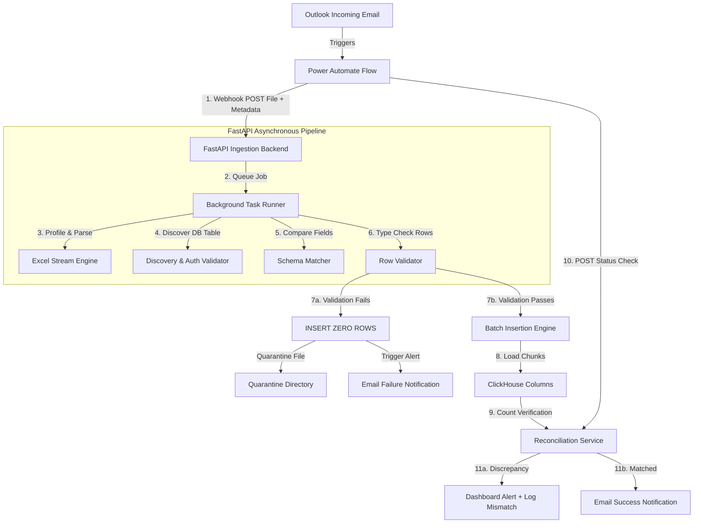

# Outlook-to-ClickHouse Ingestion & Monitoring Platform

An enterprise-grade, secure, and observable data pipeline that automates ingestion, profiling, schema validation, and reconciliation of Excel attachments received via Outlook.

---

## 1. Product Overview & Problem Statement

### The Problem
Data operations teams often receive transaction logs, billing schedules, and inventory lists as Excel attachments via email. Manually downloading, inspecting, verifying data types, and writing SQL insertion scripts is:
1. **Error-prone**: Humans can easily overlook invalid date formats or negative numbers in unsigned fields.
2. **Slow & Inefficient**: Processing attachments manually takes minutes per email, stalling real-time analytics.
3. **Risky**: Partial uploads on failure corrupt database consistency, and silent schema drifts break downstream dashboards.

### The Solution
This platform bridges **Microsoft Outlook (via Power Automate)** and **ClickHouse** through a secure, validation-first backend engine. It automates Excel attachment detection, performs multi-layered schema and data type checking, inserts validated rows in optimal database batches, and reconciles operations, alerting administrators in case of discrepancies.

---

## 2. Key Features

*   **Zero-Guess Target Mapping**: Requires explicit database and table targets (e.g., in email subjects or bodies) preventing dangerous automated AI guesses.
*   **Layer 1-5 Validation Engine**: Check files, table existence, schema differences, cell-level data types (UInt, Int, Floats, DateTimes, Bools), and row constraints before touching ClickHouse.
*   **All-or-Nothing Safety Rule**: If a single cell contains a data type mismatch (e.g. text in an ID field) or a column is missing, the engine inserts **zero rows** and quarantines the file.
*   **Asynchronous Processing**: Process large sheets in memory-safe chunks using background workers.
*   **Power Automate Webhook Reconciliation**: Cross-references Power Automate's processed metadata against backend insertion counts to immediately flag discrepancies.
*   **Modern SaaS Dashboard**: High-fidelity dark mode containing active logs, side-by-side schema mapping, audit timelines, quarantine tools, and real-time polling updates.
*   **Zero-Dependency Local Simulator**: Built-in SQLite-based ClickHouse Connection Emulator and Power Automate Webhook simulator to test all pipelines immediately out of the box.
*   **Optional Direct Outlook Polling**: Support for connecting directly to Outlook mailboxes via secure IMAP as a native alternative to Power Automate flow webhooks.

---

## 3. System Architecture & Workflow



---

## 4. Repository Structure

```text
├── backend/
│   ├── app/
│   │   ├── api/             # API Router endpoints (Auth, Webhooks, Jobs)
│   │   ├── services/        # Core business logic (Excel, ClickHouse, Validation)
│   │   ├── config.py        # Settings loader
│   │   ├── database.py      # SQLAlchemy initialization
│   │   ├── models.py        # SQLAlchemy relational models
│   │   └── main.py          # FastAPI application entrypoint
│   └── run.py               # Backend startup script
├── frontend/
│   ├── src/
│   │   ├── App.tsx          # Single-Page Dashboard client
│   │   ├── index.css        # Premium Vanilla CSS styling sheet
│   │   └── main.tsx         # React entrypoint
│   ├── package.json
│   └── vite.config.ts
├── power-automate/          # PDF and Markdown step-by-step setup guides
├── README.md
├── SETUP_GUIDE.md
└── PRODUCTION_PITCH.md
```

---

## 5. Technology Stack

*   **Backend**: Python 3.14, FastAPI, SQLAlchemy, openpyxl, pandas, clickhouse-connect
*   **Database**: PostgreSQL (Production metadata / audit), SQLite (Local dev / prototype), ClickHouse (Target DW)
*   **Frontend**: React, Vite, TypeScript, Vanilla CSS (Tailwind avoided to preserve custom design tokens)
*   **Integration**: Microsoft Power Automate (Outlook Connector, HTTP Webhooks)

---

## 6. Local Quick Start

To launch the prototype immediately on Windows, follow these commands:

1.  **Clone / Navigate to workspace**:
    ```powershell
    cd C:\Users\CLIRKOL-56\Documents\Email_to_Data_inserter
    ```
2.  **Start Backend (FastAPI)**:
    ```powershell
    cd backend
    pip install -r requirements.txt
    python run.py
    ```
3.  **Start Frontend (React/Vite)**:
    ```powershell
    cd ../frontend
    npm install
    npm run dev
    ```
4.  **Login Credentials**:
    *   **URL**: `http://localhost:5173`
    *   **Username**: `admin`
    *   **Password**: `admin123`

*For comprehensive staging and production setups, refer to [SETUP_GUIDE.md](file:///C:/Users/CLIRKOL-56/Documents/Email_to_Data_inserter/SETUP_GUIDE.md) and [WORKFLOW_GUIDE.md](file:///C:/Users/CLIRKOL-56/Documents/Email_to_Data_inserter/WORKFLOW_GUIDE.md).*
